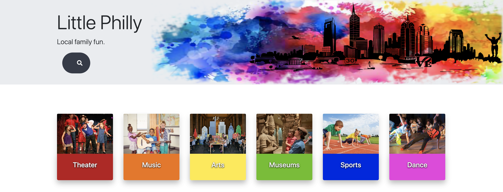
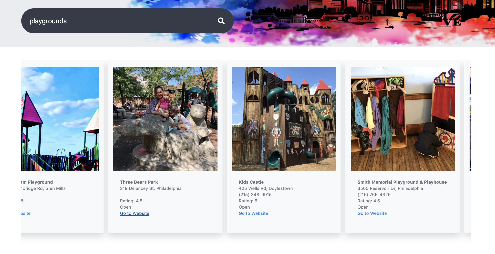
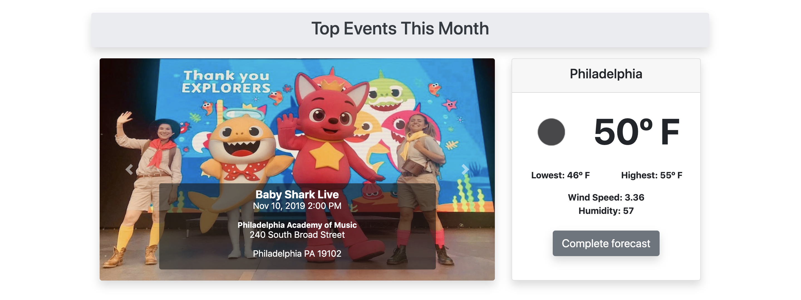
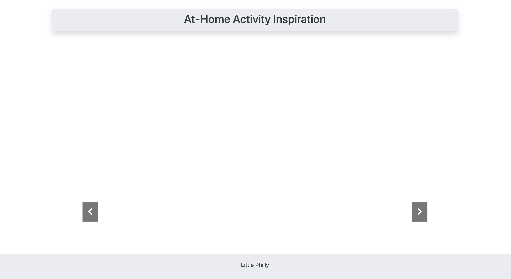

# LITTLE PHILLY
---
---

## Created by:
### Valentyna Abraimova, Sam Pizzo, and Christopher Gottshalk Jr.
---
---
**Little Philly** is a website created for our first group project in the Penn LPS Coding Bootcamp. It consisted of Valentyna Abraimova, Sam Pizzo, and Christopher Gottshalk Jr. 
We had to use everything we learned so far in the bootcamp into this project. The main challenge at first was getting used to using Git in a group setting. The project also makes use of HTML5, CSS3, jQuery, Javascript, Bootstrap, Google Fonts, momentjs, and various APIs.
The APIs that were used: 
- Yelp
- Eventful
- Youtube
- OpenweatherData

**Little Philly** is a website intended for parents or guardians to have a place to go to find cool events, activities, classes, etc. for kids. Basically a one stop shop to find everything cool going on in and around Philly that is family friendly. We believe a site like this eliminates the need to scour crowded Facebook and similar sites to find on what's going on around the city. A nice tool for busy parents to use to keep their kids more active in the community and away from the screens! You can also search for the best rated businesses with our Yelp API. If you need to search for Doctors, Dentists, etc. we also make that easy while you are looking for fun things to do during the coming month. We have quick link cards posted with popular topics ready for you to research. Our carousel that sits in the middle of the page shows the top upcoming events for the next couple of weeks generated from our Eventful API. The weather is displayed right along that so you can see if it's safe to leave the house! If you can't leave the house we have video suggestions for you from YouTube with many fun activities to do with your children on those rainy days.
Basically we want you to get out of the house and more invovled in the community with your children. Stop putting on Baby Shark for the 203rd time. Forget PJ Masks or The Amazing World of Gumball. NO MORE FORTNIGHT! Hit the streets and see a show. Visit an Art Gallery, smash a couple chicken fingers and get involved in Little Philly!
---
---
---

*Top of page with header and animated search field*

*When user enters something in the search field these cards are being dynamically made with jQuery and populating the top 10 results. Yelp API.*

*Middle of the page using Eventful and Weather API. Carousel made by Bootstrap. Top events are generated from the ajax call and dynamically put into carousel using jQuery and Javascript.*

*Youtube player with suggested videos from our YouTube API. This picture was taken when we reached our limit for the day. Oops.*
---
---
---
We broke up all the tasks pretty evenly. Sam handled the bulk of the front end/design work. Creating that beautiful header especially. Val and Chris worked with the APIs and getting the ajax calls to work with their related fields in the Javascript file creating items dynamically with jQuery selectors.

#### IceBox Items

| Val           | Chris           | Sam        |
|:-------------:|:-------------:|:------------:|
|Philly Fun Guide API | Message Board | Favorites    |
|      | User Auth     |          |
| |    Haircut   | Sleep         |

If we had more time we could try to go back and get to these items. Also, while it is mobile responsive and looks really nice on a phone, there are a couple things we could go back and touch up.

